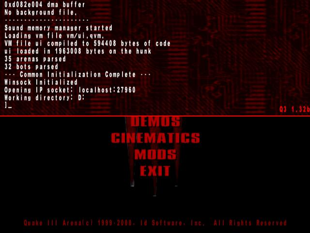

QuakeLikeConsole
================

bind a key to toggle your bash console on Windows

If you use one of 

- [Git Bash](https://git-scm.com/download/win)
- [Babun](https://github.com/babun/babun)
- [Cygwin](https://www.cygwin.com/)
- [Console2](http://sourceforge.net/projects/console/)
- [ConsoleZ](https://github.com/cbucher/console)
- _or any similar console program_

This [AutoHotKey]() script will bind to the most useless key on windows <kbd>F1</kbd> to toggle your console, as in Quake III :)

By default the script will work with Babun, but don't worry, if you prefer another console program you can tweak the config file `%USERPROFILE\.QuakeLikeConsole.ini`.